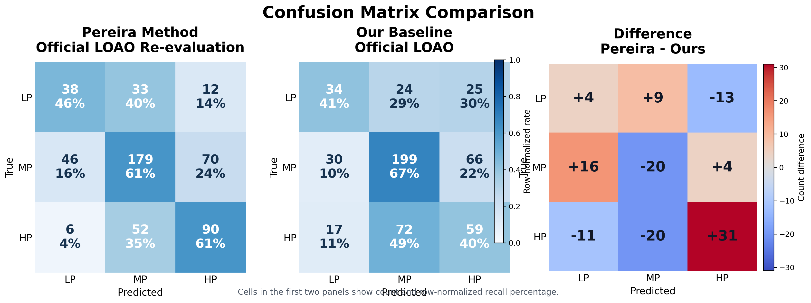
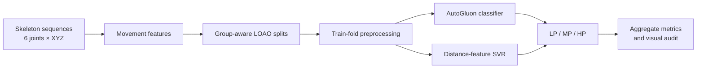

# AI4Pain 2026: Movement-Based Pain Classification

[](https://www.python.org/)
[](https://auto.gluon.ai/)
[](docs/DATA.md)

Research code for classifying low, medium, and high pain from skeleton movement
sequences in the AI4Pain 2026 Movement Track. The repository focuses on
leakage-aware evaluation, interpretable handcrafted motion features, and a
controlled comparison between an AutoGluon baseline and a compact
pairwise-distance SVR pipeline.



## What this repository demonstrates

- Feature engineering from six tracked joints, including normalized positions,
  velocity, acceleration, jerk, joint angles, and pairwise distances.
- Nested leave-one-activity-instance-out (LOAO) evaluation to keep related
  movement segments in the same fold.
- Fold-local scaling, feature selection, missing-value handling, and SMOTE to
  reduce information leakage.
- AutoGluon model selection and ensemble reporting.
- An independent LOAO re-evaluation of a pairwise-distance SVR method with
  healthy-control PCA augmentation.
- Reproducible command-line workflows for feature extraction, training,
  evaluation, and figure generation.



## Snapshot of results

Both rows below use the same 526 pain segments and 54 held-out activity
instances. These are experiment snapshots, not claims of clinical validity.

| Pipeline | Accuracy | Balanced accuracy | Macro F1 | Weighted F1 |
|---|---:|---:|---:|---:|
| AutoGluon baseline | 0.555 | 0.494 | 0.495 | 0.555 |
| Pairwise-distance SVR re-evaluation | 0.584 | 0.558 | 0.547 | 0.587 |

Machine-readable aggregate results are available in [`results/`](results/).
The exact method reuse and deviations for the SVR comparison are documented in
[`docs/PEREIRA_LOAO_AUDIT.md`](docs/PEREIRA_LOAO_AUDIT.md).

## Repository layout

```text
.
├── src/
│   ├── emopain_autogluon_baseline.py
│   ├── emopain_data_utils.py
│   ├── evaluate_pereira_loao.py
│   ├── export_emopain_features_to_csv.py
│   └── plot_*.py
├── tests/
│   └── test_emopain_data_utils.py
├── docs/
│   ├── DATA.md
│   └── PEREIRA_LOAO_AUDIT.md
├── results/
│   ├── loao_confusion_matrix_comparison.png
│   └── *_summary_metrics.json
├── requirements.txt
└── requirements-dev.txt
```

## Quick start

The validated environment uses Python 3.12.

```bash
python -m venv .venv
source .venv/bin/activate
python -m pip install --upgrade pip
python -m pip install -r requirements.txt
```

On Windows PowerShell, activate the environment with:

```powershell
.\.venv\Scripts\Activate.ps1
```

Place the separately obtained dataset folders in the repository root as
described in [`docs/DATA.md`](docs/DATA.md). The raw data are intentionally not
versioned.

Run a small AutoGluon smoke test:

```bash
python src/emopain_autogluon_baseline.py \
  --output-dir baseline_outputs_smoke \
  --max-outer-folds 3 \
  --inner-max-groups 5 \
  --time-limit 10
```

Run the full nested AutoGluon baseline:

```bash
python src/emopain_autogluon_baseline.py \
  --output-dir baseline_outputs \
  --time-limit 45 \
  --ag-presets medium_quality \
  --ag-model-preset tabular_fast
```

Run the independent pairwise-distance SVR re-evaluation:

```bash
python src/evaluate_pereira_loao.py \
  --output-dir pereira_loao_outputs \
  --training-mode overlapped
```

Export one-second window features for analysis:

```bash
python src/export_emopain_features_to_csv.py \
  --output-csv emopain_all_npy_features.csv
```

All commands support `--help`.

## Validation

Install the lightweight development dependencies and run:

```bash
python -m pip install -r requirements-dev.txt
python -m pytest
python -m compileall -q src tests
```

## Data, privacy, and responsible use

The EmoPain@Home recordings are not included. Raw skeleton files, participant-
level predictions, feature tables, trained models, caches, and local environment
files are excluded by `.gitignore`. Only aggregate evaluation artefacts are
published here.

Pain labels are subjective, the cohort is limited, and performance varies by
class. This code is for research and benchmarking only; it is not a medical
device and must not be used for diagnosis or treatment decisions.

## Status

This is an experimental research codebase prepared for transparent inspection
and reproducibility. Results may change as the evaluation protocol and feature
pipeline are refined.

## Reuse

No open-source licence is currently attached. Please contact the repository
owner before reusing or redistributing the code.
